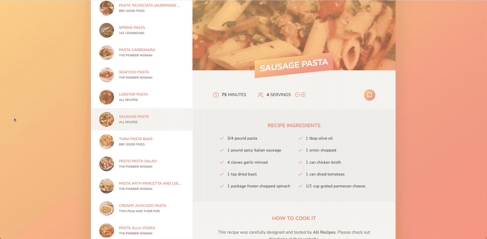
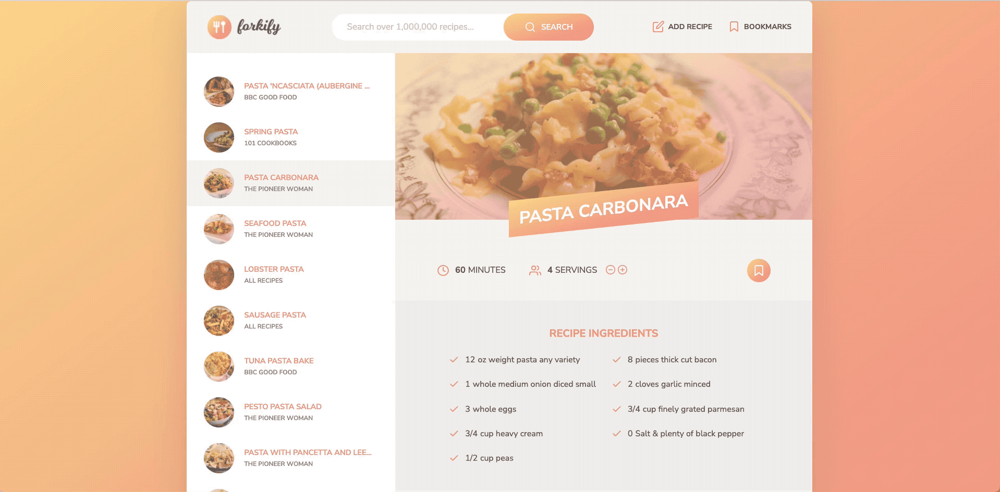
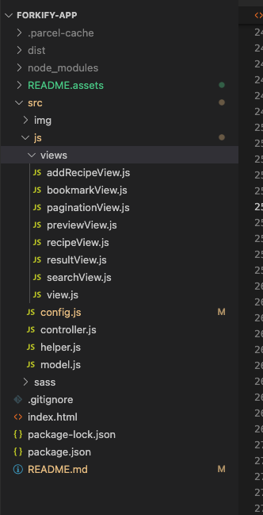

# Forkify-App
[Live Link](https://forkify-jungff.netlify.app/)

### Project Introduction

Forkify is a recipe web app using the Forkify API to allow users to search, view, modify, bookmark and add recipes.

### Technologies used

1. HTML5
2. SCSS/CSS3
3. JavaScript

### External libraries and APIs:

* Parcel
* Sass
* [Forkify-API](https://forkify-api.herokuapp.com/v2)

### Ways to reproduce

* `npm i`
* `npm start`
* `npm run build`

### Features

* Query an ingredient to recieve a list of recipes containing that ingredient.

* Change the servings size to alter the needed ingreident count proportionally.

* Easily bookmark or unbookmard the selected recipe.

* Create your own recipes and store them as user recipes(use a special icon).

* LocalStorage keeps the data when users exit the app.

### Project Architecture

Built using the MVC Architecture. View class extends the rest of the components. Controller keeps bidirectional dataflow. Model makes http requests. 

